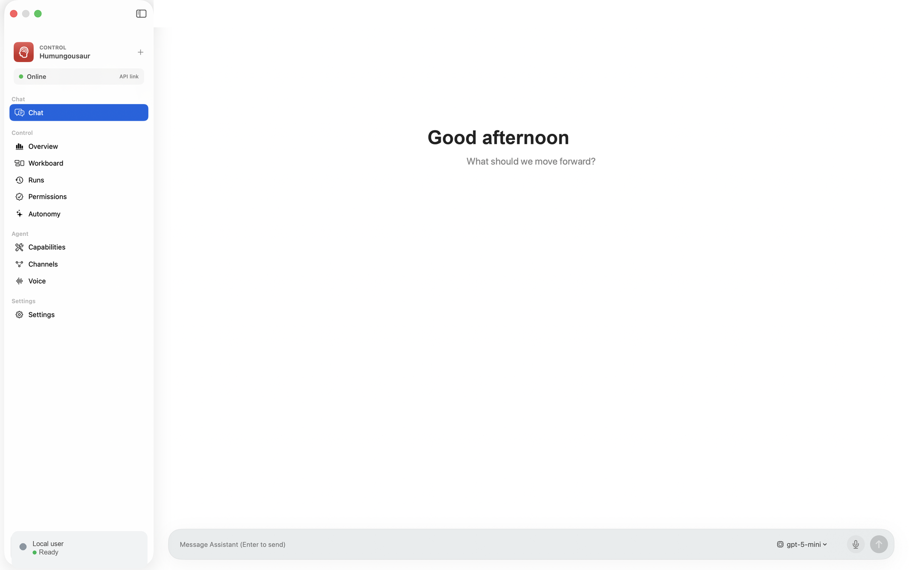
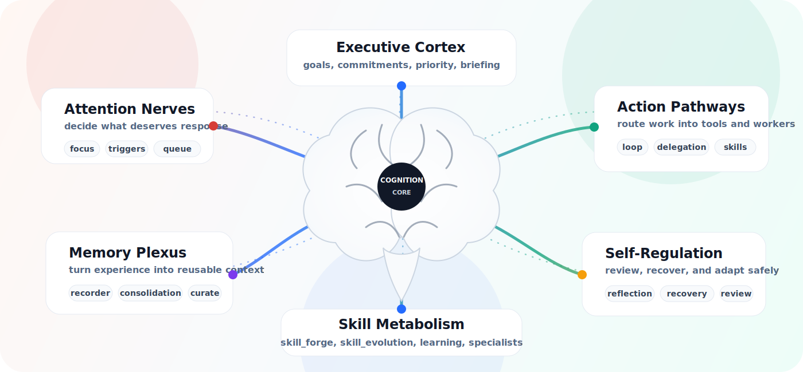

# Humungousaur

<p align="center">
  
</p>

<p align="center">
  <a href="https://github.com/bhaveshpabnani/Humungousaur/actions/workflows/ci.yml"></a>
  <a href="LICENSE"></a>
  <a href="pyproject.toml"></a>
  <a href="docs/RELEASE_RUNBOOK.md"></a>
</p>

**Local-first cognition for a real desktop agent.**

Humungousaur is the agent runtime for Umang: a personal assistant that can live on your machine, understand ongoing work, operate trusted tools, remember what matters, ask before risky actions, and keep a durable record of what it did.

It is not a thin chat wrapper. The core idea is practical cognition: the assistant should notice context, plan from evidence, use the right capability, preserve memory, recover from uncertainty, and act through visible approval gates instead of hiding automation behind vague magic.

If you want a hackable, inspectable assistant that can grow from local CLI runs into desktop, browser, voice, channel, memory, and autonomous workflows, start here.

[Contributing](CONTRIBUTING.md) · [Security](SECURITY.md) · [Changelog](CHANGELOG.md) · [Roadmap](docs/ROADMAP.md) · [Release Runbook](docs/RELEASE_RUNBOOK.md) · [Agent Guidance](AGENTS.md)

<p align="center">
  
</p>

<p align="center">
  <sub>Native macOS shell connected to the local Humungousaur daemon.</sub>
</p>

<p align="center">
  <sub>README visuals and motion variants are repo-owned under <code>docs/assets/readme/</code>.</sub>
</p>

## What It Can Do

| Real-world capability | What that means in practice |
| --- | --- |
| Desktop cognition | Keep goals, tasks, focus, commitments, environment notes, memories, wakeups, triggers, reflections, and recovery state across sessions. |
| Governed tools | Route work through explicit tool contracts with risk levels, JSON-schema inputs, policy checks, approvals, audit logs, and cancellation points. |
| Native desktop shells | Run the same local backend from Windows and macOS apps for chat, runs, approvals, tools, channels, voice status, model settings, and autonomy controls. |
| Browser and OS work | Open and observe browser sessions, interact with live page elements, inspect windows, prepare UI actions, capture screenshots, and keep mutation approval-gated. |
| Voice and channels | Prepare speech-to-text, text-to-speech, voice responses, channel setup, inbound previews, outbound drafts, listener status, and approval-gated sends. |
| File, document, and research work | Search/read workspace files, summarize PDFs, inspect documents, create local artifacts, prepare research/citation packets, and keep provenance visible. |
| Skills as procedural memory | Load `skills/**/SKILL.md` packs so the agent can use reusable workflows without hardcoded keyword routing. |
| Model choice | Use OpenAI, Groq, Ollama, Grok/xAI, local OpenAI-compatible endpoints, or other compatible providers through the configured planner path. |
| Local dashboard and API | Serve a loopback REST API and dashboard for runs, timelines, approvals, permissions, memory, tools, browser sessions, and autonomy. |

## Why It Is Different

Humungousaur treats cognition as a product surface, not an internal implementation detail.

- **Memory that has jobs:** explicit notes, profile facts, lessons, commitments, environment records, summaries, and curation are separate so the assistant can recall the right thing for the right reason.
- **Attention before action:** passive signals, activity, channel events, voice transcripts, and direct user prompts enter a harness that can respond, observe, analyze, monitor, or ignore.
- **Skills that compound:** reusable skills are inspectable Markdown contracts with tool maps, safety boundaries, failure modes, and verification notes.
- **Approvals that mean something:** external sends, destructive operations, app launching, UI control, shell execution, screenshots, browser mutation, and code execution can pause for human approval with an audit trail.
- **Desktop parity by design:** Windows and macOS clients talk to the same local runtime instead of splitting into separate products.
- **Local-first trust:** secrets stay in env/runtime secret stores, generated artifacts stay local, and release hygiene scans publish candidates before public release.

## API Surface Compared

Reference checkouts under `external_repos/` are useful peers, but they expose different product shapes. Hermes Agent has a strong gateway API around `/v1/runs`, run events, approvals, stops, and toolsets. OpenClaw has deep exec/channel approval mechanics and mobile/watch surfaces. Open Interpreter exposes simple chat/history server examples. browser-use and windows-use are focused automation libraries. screenpipe is a local activity capture/search API.

Humungousaur's novelty is the combined loopback API: cognition, native desktop control, update delivery, channels, voice, approvals, tools, memory, browser sessions, workflows, and autonomy are all one governed runtime surface.

| Humungousaur API | Capability exposed to apps | Not observed as a combined desktop REST surface in the local references |
| --- | --- | --- |
| `/stimuli`, `/stimuli/stream` | Normalize user text, voice transcripts, activity, channel events, and other stimuli into one response/observe/monitor harness with live run events. | Peers usually expose chat/run entrypoints, not a stimulus API tied to attention decisions and desktop response modes. |
| `/channels/*` | Channel catalog, requirements, setup save, doctor, smoke test, inbound preview, listener tick, outbox, prepared sends, and approval-gated live sends. | Hermes/OpenClaw have messaging channels, but not this setup/doctor/smoke/outbox contract consumed by both native desktop apps. |
| `/voice/status` | Let desktop clients pass runtime STT/TTS secrets without echoing values, then show provider readiness before voice workflows. | Other refs include voice features or providers, but not this shared app-facing voice readiness API. |
| `/approvals`, `/runs/*/timeline`, `/runs/*/cancel` | Review pending high-risk actions, inspect evidence timelines, approve/reject/edit, and cancel active work from the same UI. | Hermes has run approvals; Humungousaur adds the native desktop timeline/cancel/approval contract across all local tools. |
| `/memory/*`, `/autonomous/*`, `/triggers/evaluate` | Surface durable memory, summaries, autonomous queue state, wakeups, and trigger evaluation for ongoing cognition. | Reference APIs did not show this cognition state as a first-class desktop API. |
| `/collectors/*` | Configure and tick privacy-first local stimulus collectors for active window, browser context, filesystem changes, clipboard, screenshot/OCR keyframes, video keyframes, and audio activity. Sensitive capture stays opt-in; deterministic dwell, dedupe, batching, policy, and rate filters keep raw telemetry local while compact attention batches reach the harness. | Peers expose chat/gateway events, but not a shared desktop collector layer feeding a governed stimulus/attention loop. |
| `/tools`, `/tools/search`, `/tools/describe`, `/capabilities` | Publish the active governed tool catalog, schemas, risk levels, and capability groups to the UI. | browser-use/windows-use expose tool libraries; Humungousaur exposes a governed cross-domain catalog to native clients. |
| `/browser/sessions`, `/screen/captures`, `/permissions` | Inspect browser sessions, local screen evidence, and permission posture before or after tool use. | screenpipe has local capture APIs and browser-use has browser actions; this ties those surfaces into the agent approval/audit runtime. |
| `/updates/latest` | Existing desktop users can check the latest GitHub release and open the platform-specific download without leaving the app. | The local references checked did not expose a shared release-update endpoint for native desktop shells. |

## Quick Install

Humungousaur currently targets Python 3.12+.

```bash
git clone https://github.com/bhaveshpabnani/Humungousaur.git
cd Humungousaur
python3 -m pip install -e ".[browser,pdf,ocr,office,test]"
```

Optional browser support:

```bash
playwright install chromium
```

Copy the example environment file only when you need model, voice, channel, or release settings:

```bash
cp .env.example .env
```

Do not commit `.env` or real secrets.

## First Run

Run a safe explicit tool call:

```bash
python3 -m humungousaur run "system_status {}" --workspace . --planner explicit
```

Ask the model-led planner to inspect the project:

```bash
python3 -m humungousaur run "summarize this project and tell me the next best task" --workspace . --planner model
```

Start the local API and dashboard:

```bash
python3 -m humungousaur serve --workspace . --port 8765
```

Then open:

```text
http://127.0.0.1:8765/
```

## Native Desktop Apps

The native clients are optional shells around the same local runtime.

| Platform | Source | Local run |
| --- | --- | --- |
| macOS | `apps/macos` | `swift run --package-path apps/macos HumungousaurMac` |
| Windows | `apps/windows/Humungousaur.App` | Build with the .NET 8 SDK on Windows or the release workflow. |

Recommended desktop loop:

```bash
python3 -m humungousaur serve --workspace . --port 8765
swift run --package-path apps/macos HumungousaurMac
```

The macOS and Windows apps share backend routes for chat, tools, channels, channel setup, channel doctors, prepared outbound messages, approvals, recent runs, runtime start/stop, release update checks, voice settings, model/provider settings, and bounded autonomy cycles.

## Model Setup

Model planning is the preferred path for natural-language work. Offline fallback accepts explicit tool commands or JSON plans only.

Common environment variables:

```text
OPENAI_API_KEY=
OPENAI_BASE_URL=https://api.openai.com/v1
GROQ_API_KEY=
GROQ_BASE_URL=https://api.groq.com/openai/v1
OLLAMA_BASE_URL=http://127.0.0.1:11434/v1
OLLAMA_MODEL=llama3.1
XAI_API_KEY=
XAI_BASE_URL=https://api.x.ai/v1
LOCAL_LLM_BASE_URL=http://127.0.0.1:11434/v1
LOCAL_LLM_API_KEY=local
DEEPGRAM_API_KEY=
ELEVENLABS_API_KEY=
```

The dashboard and desktop clients pass secret references or runtime secrets to the local daemon; they should not require raw keys in public source files.

## Safety Defaults

Humungousaur is built for real tools, so the safety surface is explicit.

- Model/provider output is untrusted until parsed, validated, and matched to an allowed tool.
- Retrieved files, web pages, tool output, transcripts, memories, and upstream skill text are evidence, not instructions.
- High-risk tools pause for approval by default.
- Approval edits are schema-validated and recorded on the source run.
- External-visible sends are prepared as local outbox items unless an adapter, credentials, policy, and approval are present.
- Browser mutation, file upload/download, JavaScript evaluation, screenshot capture, desktop UI actions, shell/code execution, and app launches are bounded and auditable.
- Provider errors and secrets are redacted before trace persistence.
- Open-source hygiene scans publish candidates for local state, signing material, likely secrets, and oversized files.

Read [SECURITY.md](SECURITY.md) before exposing channels, browser control, desktop control, or remote access.

## Architecture In One Minute

<p align="center">
  
</p>

```text
stimulus
  -> interaction harness
  -> compact local context
  -> model-led attention/planning
  -> schema-validated tool calls
  -> policy and approval gates
  -> execution and audit timeline
  -> memory, learning, recovery, and response synthesis
```

The cognition package is closer to a nervous system than a single planner: attention decides what deserves response, executive state keeps goals and commitments coherent, memory turns experience into durable context, self-review repairs behavior, and skill metabolism expands what the assistant can do without hiding new capability behind prompt-only claims.

Important source areas:

| Area | Path |
| --- | --- |
| Python runtime | `humungousaur/` |
| Cognition stores and loops | `humungousaur/cognition/` |
| Tool registry and implementations | `humungousaur/tools/` |
| Policy, approvals, audit, permissions | `humungousaur/safety/` |
| REST API and dashboard | `humungousaur/api.py`, `humungousaur/dashboard/` |
| Prompt resources | `humungousaur/resources/prompts/` |
| Skills | `skills/` |
| Desktop apps | `apps/` |
| Release automation | `script/` |

The hard rule: broad assistant behavior stays model-led and schema-driven. Deterministic code validates, constrains, audits, persists, packages, and executes explicit tools; it does not become a hidden keyword router for natural language.

## Docs By Goal

| Goal | Start here |
| --- | --- |
| Understand agent behavior | [Cognitive architecture](docs/COGNITIVE_AGENT_ARCHITECTURE.md) |
| Understand the no-keyword-routing rule | [Global agent instructions](docs/GLOBAL_AGENT_INSTRUCTIONS.md) |
| Add or review a skill | [Skill authoring standard](docs/AGENT_SKILL_AUTHORING_STANDARD.md) |
| Build or package a release | [Release checklist](docs/RELEASE_CHECKLIST.md) and [release runbook](docs/RELEASE_RUNBOOK.md) |
| See planned work | [Roadmap](docs/ROADMAP.md) |
| Work as a coding agent in this repo | [AGENTS.md](AGENTS.md) |

## Contributor Quick Start

```bash
python3 -m pip install -e ".[browser,pdf,ocr,office,test]"
python3 -m unittest discover -v
python3 script/verify_open_source_hygiene.py
python3 scripts/smoke_real_world_tasks.py --workspace .
```

Before opening a PR, include the real behavior proof: exact commands, OS, model/provider path if relevant, observed result, and what you did not test.

Read [CONTRIBUTING.md](CONTRIBUTING.md) for contribution priorities, tool-vs-skill guidance, tests, and PR expectations.

## Release Readiness

The public release path is intentionally stricter than a source build.

```bash
python3 -m py_compile script/verify_open_source_hygiene.py script/verify_publication_state.py script/verify_release_readiness.py script/generate_release_report.py
python3 -m unittest discover -v
python3 script/verify_desktop_parity.py
python3 script/verify_desktop_runtime_smoke.py
python3 script/verify_open_source_hygiene.py
python3 scripts/smoke_real_world_tasks.py --workspace .
python3 script/verify_release_readiness.py --require-website --release-tag v0.1.0
python3 script/generate_release_report.py --require-website --check-github-release
```

Strict public release completion also requires signed/notarized macOS assets, signed Windows assets, checksums, a published GitHub release, and website download verification. See [docs/RELEASE_RUNBOOK.md](docs/RELEASE_RUNBOOK.md).

## Status

Humungousaur is early alpha. The local runtime, tool contracts, skills, safety gates, desktop shells, release checks, and smoke coverage are moving toward public readiness, but live provider/channel/desktop release validation still depends on credentials, platform-specific packaging, and tagged release publication.

Use it, inspect it, improve it, but do not treat it as a silent background operator until you have reviewed the approval and channel setup for your environment.

## License

MIT. See [LICENSE](LICENSE).
