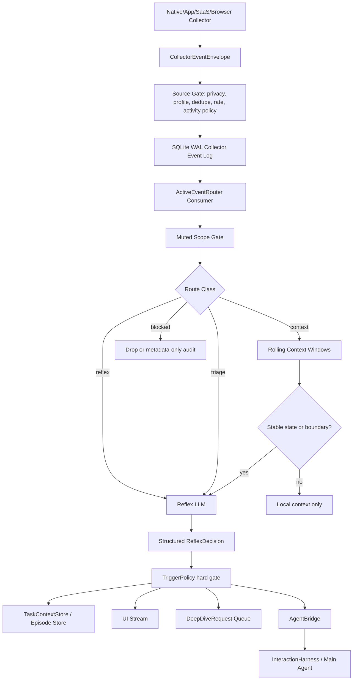

# Active Agent Collector Workflow

This document defines how Humungousaur turns collector events into an always-active
assistant without turning the desktop into a 24/7 recorder or a noisy notification
bot.

Detailed product, research, event, Reflex LLM, context-memory, and desktop UI
architecture is maintained in `docs/ACTIVE_AGENT_REFLEX_ARCHITECTURE.md`.

The core idea is a reverse-agent runtime:

```text
normal agent:
user query -> intent -> skills/tools -> actions -> result

active agent:
observed actions -> context -> reflex interpretation -> task context -> agent posture
```

Collectors remain factual source emitters. The active layer interprets local,
privacy-filtered activity into "what the human is probably doing now", what the
assistant should remember, and whether the main agent should stay quiet, prepare
help, ask, or act.

## Design Goals

- Make the agent feel present, instinctive, and useful across the day.
- Preserve the existing collector contract: `CollectorEventEnvelope` into the
  durable SQLite WAL event log.
- Avoid brittle deterministic intent scoring for human activity.
- Use model-led interpretation for activity understanding, task inference,
  interruption posture, and proactive help decisions.
- Keep deterministic code for privacy, consent, redaction, schemas, offsets,
  retry/dead-letter handling, approval gates, and exact persistence only.
- Support user-declared task context as the strongest possible signal.
- Let the user mute help, mute tracking, correct activity hypotheses, and inspect
  what the assistant thinks is happening.
- Support direct reflexes, triage of incoming app events, and quiet rolling
  context for ongoing work.

## Non-Goals

- Do not send raw collector telemetry to the main agent.
- Do not run a large LLM for every low-level event.
- Do not create one autonomous LLM agent per collector.
- Do not build a giant handcrafted rule engine for every task sequence.
- Do not infer private content from passwords, OTPs, private browsing, payments,
  sensitive documents, chat bodies, mail bodies, screenshots, clipboard values,
  transcripts, or source code unless explicit opt-in and policy allow it.

## Research Basis

The architecture is shaped by research and prior systems:

- Gloria Mark et al., "The Cost of Interrupted Work: More Speed and Stress",
  shows that interrupted users may compensate by working faster, but with more
  stress, frustration, time pressure, and effort:
  <https://ics.uci.edu/~gmark/chi08-mark.pdf>
- Mark, Gonzalez, and Harris, "No Task Left Behind?", shows that information work
  is fragmented and users frequently integrate scattered work into task
  structures:
  <https://www.ics.uci.edu/~gmark/CHI2005.pdf>
- BusyBody modeled the cost of interruption from desktop activity and contextual
  information, supporting the need for an interruptibility layer:
  <https://www.microsoft.com/en-us/research/publication/busybody-creating-fielding-personalized-models-cost-interruption/>
- TaskTracer treated task context, resources, and task resumption as a desktop
  assistance problem:
  <https://web.engr.oregonstate.edu/~tgd/publications/iui2005-tasktracer.pdf>
- ActivityWatch separates local watchers from later analysis and uses AFK/window
  watchers as low-level activity sources:
  <https://docs.activitywatch.net/en/latest/watchers.html>
- Activity-centric computing argues for "activity" as a first-class abstraction
  across apps, files, services, and devices:
  <https://cacm.acm.org/research/activity-centric-computing-systems/>
- Personal information management research frames daily work as acquiring,
  creating, storing, organizing, retrieving, and using information:
  <https://www.microsoft.com/en-us/research/publication/personal-information-management/>
- ReAct-style agent design separates reasoning from action while allowing a
  model to track and update plans from observations:
  <https://arxiv.org/abs/2210.03629>

## Existing Foundation

The collector layer already provides the right foundation:

```text
native/app/browser/SaaS source
  -> CollectorEventEnvelope
  -> local SQLite WAL event log
  -> independent consumers
  -> compact attention batch
  -> InteractionHarness
```

The active-agent workflow adds an interpretation layer between the event log and
the main attention boundary:

```text
CollectorEventEnvelope
  -> hard privacy/source gates
  -> ActiveEventRouter
  -> ReflexInterpreter / ContextWindow
  -> TaskContextStore
  -> TriggerPolicy
  -> AgentBridge
  -> InteractionHarness or UI-only state
```

The model-led rule from `docs/GLOBAL_AGENT_INSTRUCTIONS.md` applies here:
activity interpretation, proactive assistance, interruption posture, task state,
and memory importance are intelligent decisions and must be model-led.

First runtime slice implemented:

- `humungousaur/active_agent/` now contains the durable store, route records,
  task context records, muted scopes, deep-dive request records, activity guide
  loader, Reflex LLM schema/parser, and event router.
- Reflex interpretation now uses the shared cognition prompt-template resource
  instead of an inline prompt.
- `humungousaur/collectors/consumers/active_agent.py` consumes the collector WAL
  stream with an independent offset.
- Collector ticks invoke the active-agent consumer after memory/semantic/UI
  consumers.
- `do_not_track` muted scopes block durable storage where events enter the
  collector bus, and `do_not_send_to_llm` muted scopes suppress attention-batch
  inclusion.
- API and CLI surfaces expose status, user-declared task context, muted scopes,
  and deep-dive requests.
- Muted scopes can be cancelled, and deep-dive requests can be approved or
  rejected through service, API, and CLI surfaces.
- The Agent Bridge persists accepted `prepare`, `ask_user`, `wake_main_agent`,
  and `request_deep_dive` activations with status, `response_mode`,
  `stimulus_id`, exact evidence refs, and harness result capture.
- User-declared task context is projected into `FocusStore` so the cognition
  layer has a current, evidence-backed task focus.
- Context events are now written into rolling, collector, source, and hashed
  entity context windows so Reflex interpretation receives generalized
  continuity evidence without hard-coded task episodes.
- Sustained context and return-after-gap boundaries are persisted once, then
  passed through the Reflex LLM to prepare resume capsules without spamming the
  model on every follow-up event.
- UI-safe explanation artifacts are recorded for quiet context observations,
  muted/blocked routes, Reflex decisions, and context-boundary decisions.
- User corrections are durable and can update task focus or create privacy,
  not-now, no-assistance, and do-not-track muted scopes.
- Initial activity guides exist for document authoring, research, coding and
  debugging, communication replies, meeting follow-up, spreadsheet analysis,
  presentation creation, issue triage, and incident response.
- Approved deep-dive requests can now execute a local metadata-only deep dive
  that gathers recent collector envelopes, episode state, task context,
  corrections, and resume capsules without reading raw content. The result is
  durable in `active_deep_dive_results` and linked back to the episode.
- Direct user responses to `ask_user`/prepared activations are durable in
  `active_activation_responses`. Accept/clarify responses can update task
  context; decline/not-now/private responses cascade through the correction and
  mute lifecycle.
- Episode operations now support pause, resume, complete, abandon, merge, and
  split through first-class service/API/CLI paths. Merge/split relationships are
  recorded in `active_episode_links`.
- Collector-specific entity extraction now converts known provider/app object
  ids into hashed entity refs so continuity can be tracked across collectors
  without leaking raw titles, names, URLs, paths, or content.
- Active-agent privacy export/delete and replay eval runs are implemented as
  local auditable operations. Exports are active-agent state only and do not
  include raw collector payloads.
- Reflex can use the shared model-provider runtime with local/small model
  providers such as `ollama` and `local-openai`; active-agent status exposes the
  configured Reflex model path.
- Additional activity guides now cover design review, customer support, sales
  CRM, data analysis, financial admin, and learning/study workflows.

## High-Level Architecture



## Implemented Active-Agent Lifecycle Surfaces

The current implementation exposes these lifecycle operations:

| Surface | Service/API/CLI | Behavior |
| --- | --- | --- |
| Deep-dive execute | `execute_deep_dive_request`, `/active-agent/deep-dives/execute`, `active-agent-deep-dive-execute` | Requires an approved request, gathers metadata-only evidence, records a durable result, marks the request completed, and links the result to the episode when present. |
| Activation response | `respond_to_activation`, `/active-agent/activations/respond`, `active-agent-activation-respond` | Records accept/decline/not-now/private/clarify/wake-agent responses and updates task context, corrections, mutes, or harness submission accordingly. |
| Episode operation | `apply_episode_operation`, `/active-agent/episodes/operate`, `active-agent-episode-operate` | Pauses, resumes, completes, abandons, merges, or splits episodes with durable links and evidence refs. |
| Privacy export/delete | `active_agent_privacy_export`, `active_agent_privacy_delete`, `/active-agent/privacy/export`, `/active-agent/privacy/delete` | Exports or deletes scoped active-agent records. Raw collector payloads are not included in exports. |
| Replay eval | `run_active_agent_eval`, `/active-agent/evals/run`, `active-agent-eval-run` | Checks active-agent state invariants around episodes, safety notes, approval-gated deep dives, and memory/activation counts. |

The metadata deep-dive executor is intentionally not a rich-content executor.
Provider-specific document reads, message reads, transcript reads, screenshots,
file-content reads, SQL/result reads, sends, edits, and destructive actions
still require tool-specific approval-gated executors wired behind the same
`DeepDiveRequest` contract.

## Route Classes

Every accepted collector event is routed into one of six classes. Routing itself
uses mechanical event metadata and explicit collector contracts; interpretation
uses the reflex model.

| Route class | Meaning | Model behavior |
| --- | --- | --- |
| `reflex` | Instinctive state-change stimulus. | Call small Reflex LLM immediately with compact state. |
| `triage` | Incoming external stimulus that may matter. | Call small Reflex LLM to decide relevance, urgency, and posture. |
| `context` | Ongoing work signal. | Add to rolling context; call model only at stable state changes or boundaries. |
| `muted` | User has said no help or no tracking for scope. | Suppress, minimize, or stop recording according to mute mode. |
| `blocked` | Privacy/safety gate says no. | Drop or store only redacted policy audit. |
| `deep_dive` | Richer inspection is requested. | Queue approval before any content access. |

### Reflex Events

Reflex events are "nervous system" events. They can wake the small LLM without a
large context window:

- `system_started`
- `user_logged_in`
- `screen_unlocked`
- `wake_started`
- `external_display_connected`
- `workspace_switched`
- `focus_mode_enabled`
- `meeting_joined`
- `meeting_left`
- `voice_wakeup_detected`
- `global_hotkey_pressed`
- `explicit_assistant_opened`
- `user_returned_after_gap`
- `new_work_session_started`

Reflex outputs should usually be quiet:

- show presence
- restore awareness
- prepare a resume capsule
- ask one short question at a safe boundary
- queue main agent only when the event is explicit or high-value

### Triage Events

Triage events are incoming changes from the world:

- email received
- Slack/Teams mention
- calendar invite
- file shared
- PR review requested
- issue assigned
- build failed
- test failed
- incident alert
- meeting transcript available
- payment/invoice/order alert
- auth/MFA/account prompt

The reflex model decides:

- related to current task?
- urgent?
- can wait?
- should prepare?
- should ask?
- should wake main agent?
- should avoid because sensitive?

### Context Events

Context events should not wake the model individually:

- tab changed
- document saved
- file modified
- cursor/selection changed
- window moved
- app switch shorter than dwell
- scroll
- editor focus changed
- repeated autosaves
- background sync

They accumulate in a context window and become model input only when there is a
meaningful boundary:

- stable app or artifact focus for a configured dwell period
- return after gap
- switch from source material back to a work artifact
- repeated friction signals
- completion signal
- task handoff or meeting boundary
- user explicitly asks "what am I doing?" or opens the active-agent UI

## Small Reflex LLM

The Reflex LLM is small, fast, structured, and non-tool-using. It is not the main
agent. It performs local interpretation and posture selection.

### Responsibilities

- Interpret compact recent activity.
- Update or create task context hypotheses.
- Decide whether to stay silent, remember, prepare, ask, or wake the main agent.
- Decide whether a deep-dive request would be useful.
- Respect muted scopes, user-declared goals, and active privacy state.
- Produce strict JSON only.

### Non-Responsibilities

- It must not execute tools.
- It must not inspect raw content by itself.
- It must not override privacy policy.
- It must not decide approval bypass.
- It must not produce user-facing long replies.
- It must not become the main planner.

### Input Contract

```json
{
  "stimulus": {
    "route": "reflex",
    "collector": "device_state",
    "stimulus_type": "screen_unlocked",
    "occurred_at": "2026-06-11T08:30:00Z",
    "privacy_tier": "metadata"
  },
  "recent_context": {
    "away_minutes": 42,
    "active_app_summary": "document editor before lock",
    "recent_event_summaries": [
      "document saved",
      "browser source tab active",
      "document editor active"
    ]
  },
  "task_context": {
    "active_episode_id": "episode_123",
    "user_declared_goal": "draft Acme proposal",
    "muted": false
  },
  "policy": {
    "rich_capture_allowed": false,
    "can_interrupt_now": false,
    "private_mode": false,
    "allowed_outputs": [
      "stay_silent",
      "remember",
      "prepare",
      "ask_user",
      "wake_main_agent",
      "request_deep_dive"
    ]
  },
  "activity_guides": [
    "authoring_document",
    "research_session"
  ]
}
```

### Output Contract

```json
{
  "decision_id": "reflex_decision_abc",
  "posture": "prepare",
  "confidence": "medium",
  "should_interrupt_user": false,
  "user_visible_text": "",
  "agent_stimulus": "Prepare a resume capsule for the active document task.",
  "task_context_updates": [
    {
      "kind": "resume_detected",
      "episode_id": "episode_123",
      "summary": "User returned after a gap to the same document/source pattern."
    }
  ],
  "memory_updates": [
    {
      "kind": "working_context",
      "summary": "Document task resumed after away period."
    }
  ],
  "deep_dive_request": null,
  "safety_notes": [
    "No rich document content requested."
  ]
}
```

Allowed postures:

- `stay_silent`
- `remember`
- `summarize`
- `prepare`
- `ask_user`
- `wake_main_agent`
- `request_deep_dive`

If the model is unavailable, the runtime must not replace it with handcrafted
semantic inference. It should store the compact event window for later and choose
the safest mechanical fallback: stay silent, preserve state, or ask only for
explicit user/developer-invoked events.

## Activity Guides

Activity guides are the reverse equivalent of tool skills. They are
model-readable instructions that help the Reflex LLM interpret activity. They are
not deterministic routing rules.

Recommended location:

```text
humungousaur/active_agent/activity_guides/
  authoring_document.md
  research_session.md
  spreadsheet_analysis.md
  coding_debugging.md
  code_review.md
  meeting_participation.md
  meeting_followup.md
  communication_reply.md
  planning_project.md
  incident_response.md
  file_organization.md
  commerce_finance_workflow.md
```

Each guide should contain:

- when to consider the activity
- common signals
- signals that should not count
- privacy concerns
- useful memory
- likely resume anchors
- when to ask
- when to stay silent
- deep-dive permissions
- completion indicators
- examples of structured outcomes

Example:

```markdown
# Activity Guide: Authoring Document

Use when the user appears to be creating, editing, reviewing, or publishing a
document.

Common signals:
- document opened, edited, saved, exported, or shared
- repeated switching between a document and browser/source material
- comments, review changes, outline navigation
- paste into document after source browsing

Do not classify as authoring when:
- the document is only previewed briefly
- file sync metadata changes in the background
- the document is in private/sensitive mode
- the event is only a notification about a document

Agent posture:
- remember silently during normal editing
- prepare a resume capsule after interruption
- ask only at a boundary or when the user appears stuck
- request rich document content only after opt-in
```

The runtime passes compact guide cards to the Reflex LLM and lets the model pick
the relevant activity frame. Python must not score guides by keywords, regexes,
or handcrafted task-family bonuses. Bounded loading, schema validation, and
prompt compaction are deterministic; semantic guide choice is model-led.

## Task Context Store

Task context is not merely inferred. User-declared context has priority.

Examples:

- "I am drafting the Acme proposal."
- "No help on this doc."
- "Do not track this website."
- "Help me monitor replies to this thread."
- "Always summarize meetings with this client."

Recommended records:

```json
{
  "task_context_id": "ctx_123",
  "episode_id": "episode_123",
  "status": "active",
  "source": "user_declared",
  "user_declared_goal": "draft Acme proposal",
  "primary_entities": [
    {
      "type": "document",
      "stable_id": "doc_hash"
    }
  ],
  "supporting_entities": [
    {
      "type": "source_url",
      "stable_id": "url_hash"
    }
  ],
  "assistant_mode": "supportive",
  "allowed_help": [
    "resume_capsule",
    "source_organization",
    "ask_at_boundary"
  ],
  "privacy_mode": "metadata_first",
  "created_at": "...",
  "updated_at": "..."
}
```

User-declared context should feed:

- Reflex LLM input
- cognitive focus
- `conscious.md` projection
- UI "current task" display
- memory summaries
- muted scope decisions

## Episode Store

Episodes are durable continuity objects produced by the Reflex LLM through an
optional `episode_update` decision field. They are not built from hardcoded task
patterns. Python validates and stores model-proposed episode state, links safe
event evidence, and exposes only compact summaries.

Implemented records:

- `active_episodes`: episode id, status, source, hypothesis, summary,
  confidence, safe entity refs, task-context link, correction refs, deep-dive
  refs, evidence refs, `last_event_sequence`, and `event_count`.
- `active_episode_events`: idempotent event timeline entries with episode id,
  collector event sequence/id, relation such as `start_episode` or
  `continue_episode`, route/decision ids, and safe evidence metadata.

Episode transitions the model may request:

- `observe_only`
- `start_episode`
- `continue_episode`
- `resume_episode`
- `split_episode`
- `pause_episode`
- `complete_episode`
- `abandon_episode`

Episode state feeds future Reflex prompts as active episode hypotheses and
recent episode events, allowing the model to reason backward from actions into
human task continuity without a brittle episode builder per task type.

## Muted Scopes And Consent

The active agent must make user refusal durable and precise.

When the agent asks:

```text
Looks like you started a document. Want help?
```

Possible user responses should map to scopes:

| User response | Meaning | Runtime behavior |
| --- | --- | --- |
| "No help" | Do not assist for this task. | Keep minimal local metadata if allowed, no LLM for this scope. |
| "Not now" | Pause assistance temporarily. | Suppress asks and main-agent wakes until expiry. |
| "Don't track this" | Stop storing activity for scope. | Drop future events for entity/app/source except safety audit. |
| "Always help here" | Raise willingness for this scope. | Allow prepare/ask at more boundaries, still policy-gated. |
| "This is unrelated" | Correct episode grouping. | Split or detach context and store correction. |
| "This is private" | Sensitive scope. | Metadata-only or drop, no deep dive, no summaries. |

Muted scope record:

```json
{
  "scope_id": "mute_123",
  "mode": "no_assistance",
  "scope_type": "episode",
  "entity_refs": ["document:doc_hash"],
  "expires_at": "2026-06-11T13:00:00Z",
  "do_not_interrupt": true,
  "do_not_deep_dive": true,
  "do_not_send_to_llm": true,
  "do_not_store": false,
  "reason": "User declined help on this document."
}
```

## Context Windows

Context windows are compact local summaries, not raw logs.

| Window | Time horizon | Purpose |
| --- | --- | --- |
| Micro window | 10-60 seconds | Interpret immediate reflex or triage stimulus. |
| Work segment | 2-15 minutes | Understand stable activity and source/work-artifact switching. |
| Episode context | 15 minutes to several hours | Resume, summarize, complete, or bridge interruptions. |
| Project memory | days/weeks | Durable semantic and procedural memory only after model-led curation. |

Context windows should contain:

- event summaries
- stable entity hashes
- app/source names where safe
- counts and buckets
- time gaps
- active/idle state
- recent user-declared task context
- current muted scopes
- prior reflex decisions
- prior user corrections
- prior deep-dive request status transitions

Context windows should not contain by default:

- raw document content
- raw email/chat bodies
- raw clipboard
- raw URLs/titles where policy marks them sensitive
- screenshots/OCR/transcripts
- passwords, OTPs, credentials
- private browsing details

## Deep Dive Requests

Deep dives are explicit requests for richer context. They are not automatic
collector behavior.

Examples:

- read current document outline
- inspect selected browser page
- summarize source tabs
- read current issue comments
- inspect failing test output
- summarize meeting transcript
- extract spreadsheet schema

Deep dive states:

- `requested`
- `needs_approval`
- `approved`
- `denied`
- `completed`
- `expired`
- `blocked_by_policy`

Deep dive request contract:

```json
{
  "request_id": "deep_123",
  "episode_id": "episode_123",
  "requested_by": "reflex_llm",
  "purpose": "Prepare resume capsule for document task.",
  "source": "google_docs",
  "requested_access": "document_outline",
  "privacy_tier": "rich_capture",
  "requires_user_approval": true,
  "status": "needs_approval"
}
```

The main agent can use a completed deep dive as evidence, but cannot bypass the
queue.

## Main Agent Bridge

The Reflex LLM does not call tools. It sends a structured activation to the main
agent only after hard policy accepts the posture. The active-agent layer now
records that handoff first, then either leaves it prepared for UI/status or
submits it to the interaction harness.

Durable activation record:

```json
{
  "activation_id": "act_123",
  "posture": "wake_main_agent",
  "status": "submitted",
  "decision_id": "reflex_decision_abc",
  "route_id": "route_123",
  "event_sequence": 912,
  "response_mode": "silent",
  "stimulus_id": "active-agent-reflex_decision_abc",
  "agent_stimulus": "The user received a high-priority email related to the current proposal. Prepare a draft reply, but do not send it.",
  "allowed_actions": [
    "prepare_draft",
    "queue_approval"
  ],
  "forbidden_actions": [
    "send_message_without_approval",
    "read_rich_content_without_approval"
  ],
  "evidence_refs": [
    "collector_event:912",
    "route:route_123",
    "reflex_decision:reflex_decision_abc"
  ],
  "harness_result": {
    "run": {"status": "succeeded"}
  }
}
```

Main-agent activation rules:

- Explicit user text and voice remain direct stimuli.
- Reflex activations usually use `response_mode=silent`; `ask_user` may use a
  user-facing mode only when interruption policy allows it.
- Proactive user-facing asks should be short and boundary-aware.
- The main agent receives compact evidence and allowed actions, not raw streams.
- `stimulus_id` is persisted with the activation so harness runs and status
  views can trace the same handoff.
- Activation status is one of `prepared`, `pending`, `submitted`, `skipped`, or
  `failed`. `prepared` means saved but not submitted; `pending` means saved
  before wake submission completes; `skipped` means policy, dedupe, mute, or
  disabled bridge execution prevented submission.
- High-risk tool use still requires normal approval.

## Event Handling Examples

### Startup Or Unlock

```text
screen_unlocked
  -> reflex route
  -> Reflex LLM sees away gap and last active task
  -> prepare resume capsule silently
  -> UI shows "Ready. You were working on the Acme proposal."
```

### New Email

```text
email_received
  -> triage route
  -> Reflex LLM checks sender category, thread relation, deadline hints
  -> if related and important: prepare draft or ask at boundary
  -> if unrelated: remember silently or ignore
```

### Document Editing

```text
document_opened
  -> context route
stable editing dwell
  -> Reflex LLM asked to interpret current work
user says "No help"
  -> muted scope for that document
later document saves
  -> suppressed from LLM for scope
document shared/exported
  -> completion may be recorded locally, no proactive ask
```

### User Declares Task

```text
user: "I am drafting the Acme proposal from the pricing sheet."
  -> task_context created
document/source events
  -> linked to declared task
screen unlock after gap
  -> resume capsule uses declared goal
```

### Debugging

```text
test_failed
  -> triage route
same repo/editor active
  -> related to current task
repeated fail/fix/run loop
  -> prepare debugging summary
ask at boundary:
  "Want me to inspect the latest failure and suggest a fix?"
```

### Meeting Follow-Up

```text
meeting_left
meeting_transcript_available
calendar_next_event_gap
  -> reflex/triage route
  -> prepare follow-up summary if transcript access approved
  -> ask before sending notes or tasks
```

## Human Task Coverage

The first activity guides should cover broad work modes rather than exact app
workflows:

| Work mode | Typical collectors | Assistant value |
| --- | --- | --- |
| Document authoring | documents, browser, clipboard metadata, files, comments | resume capsule, sources, outline, blockers |
| Spreadsheet analysis | spreadsheet, data import/export, browser, files | formula/error help, analysis summary, export detection |
| Presentation creation | deck, browser, meetings, images/files | narrative continuity, asset/source tracking |
| Research session | browser, bookmarks/history, notes, downloads | source clustering, reading trail, summary |
| Communication reply | mail/chat, calendar, docs | draft prep, related context, follow-up tracking |
| Meeting participation | meeting app, audio state, calendar, screen share | notes, action items, follow-up queue |
| Coding/debugging | IDE, terminal, git, tests, build, browser | failure context, next step, PR summary |
| Issue triage | task/issue trackers, docs, calendar, code, comments | queue clarity, blockers, handoff summary |
| Incident response | alerts, cloud console, logs, chat, runbook | timeline, runbook context, handoff summary |
| File organization | file/folder/trash/cloud sync | restore, conflict, duplicate, source tracking |
| Business operations | CRM/support/finance/analytics | triage, next action, customer/account context |

## UI Requirements

The UI should make the active agent inspectable and controllable.

Required surfaces:

- Presence indicator: idle, observing, preparing, asking, muted, private.
- Current task panel: "I think you are..." with confidence and correction.
- Resume capsule card: recent task, sources, last action, next likely step.
- Reflex inbox: prepared suggestions waiting for a safe moment.
- Deep-dive approvals: exact requested source, purpose, privacy tier, expiry.
- Muted scopes panel: no-help, not-now, do-not-track, private.
- Collector health: source availability, helper permission state, lag, DLQ count.
- Activity timeline: redacted event/episode timeline with filters.
- Correction controls: "not related", "merge", "split", "private", "always help".
- Privacy mode toggle: normal, focus, private, meeting, presentation.

User-facing copy must avoid certainty when inferred:

- "Looks like you resumed..."
- "I can prepare..."
- "Want help with..."
- "I stayed quiet because this task is muted."

## Storage Design

Recommended tables or equivalent SQLite stores:

- `active_event_routes`: event sequence, route class, reason, policy result.
- `active_context_windows`: compact summaries and source sequence ranges.
- `active_reflex_decisions`: model input hash, output JSON, posture, confidence.
- `active_task_contexts`: user-declared and inferred task contexts.
- `active_episodes`: active/paused/completed task episodes.
- `active_muted_scopes`: no-help/no-track/private/not-now scopes.
- `active_deep_dive_requests`: approval-gated rich-context requests.
- `active_memory_candidates`: Reflex-selected safe memory candidates with
  `candidate`, `accepted`, `rejected`, `private`, or `archived` lifecycle state.
  Helpful feedback promotes accepted candidates into cognition
  `KnowledgeStore` rows and records `promoted_knowledge_id` on the candidate.
- `active_agent_activations`: accepted `summarize`, `prepare`, `ask_user`,
  `wake_main_agent`, and `request_deep_dive` bridge records with status,
  `response_mode`, `stimulus_id`, evidence refs, and harness result.
- `active_user_corrections`: merge/split/private/helpfulness feedback.

Corrections against `target_type=memory_candidate` update candidate state:
`helpful` accepts it, `not_relevant` or `wrong_task` rejects it, `private` or
`do_not_track` marks it private, and `not_now` or `no_assistance` archives it.
Helpful corrections against a decision or activation also accept and promote
related candidates. Invalidating corrections archive any linked
`promoted_knowledge_id`.
Each transition is mirrored as a safe `active_agent_memory_candidate_status`
memory event without raw collector payloads.

The planner consumes promoted active-agent knowledge through an explicit
`active_agent_memory` runtime context block. It is source-filtered to
`active_agent_memory_candidate`, confidence-gated, bounded to recent active
records, and carries only safe summaries plus evidence refs. The model decides
relevance; Python does not route by task keywords.

The planner consumes current active-agent continuity through a separate
`active_agent_state` runtime context block. It contains active episode
summaries, active task summaries, resume capsule summaries, activation
posture/status/actions, deep-dive request metadata, active muted scopes, and
explanation summaries. It does not include route dumps, raw model output,
memory-candidate payloads, full context-window or boundary evidence, correction
notes, `harness_result`, or raw collector payloads. Generic `recent_memory`
excludes internal `active_agent_*` audit events so unaccepted candidates cannot
bypass the promotion gate.

The Reflex LLM receives recent safe correction and deep-dive status records
before making future posture and task-continuity decisions. This lets explicit
user feedback change future behavior without adding brittle score tables or
task-keyword routers.

Every table should support:

- exact evidence refs
- created/updated timestamps
- retention policy
- redacted export
- local-only default

## Proposed Package Layout

```text
humungousaur/active_agent/
  __init__.py
  router.py
  reflex_interpreter.py
  reflex_schema.py
  context_window.py
  task_context.py
  episode_store.py
  muted_scopes.py
  deep_dive.py
  trigger_policy.py
  agent_bridge.py
  ui_projection.py
  activity_guides/
    authoring_document.md
    research_session.md
    spreadsheet_analysis.md
    coding_debugging.md
    code_review.md
    meeting_participation.md
    meeting_followup.md
    communication_reply.md
    planning_project.md
    incident_response.md
```

Collector-side consumer:

```text
humungousaur/collectors/consumers/active_agent.py
```

The consumer owns offsets over `CollectorEventLog`, calls the active-agent
router, stores local decisions, and emits only accepted activations into the
interaction harness or autonomous queue.

## Policy Boundaries

Deterministic hard gates:

- collector profile enabled/disabled
- privacy tier
- rich-capture opt-in
- private browsing
- password/OTP/credential/payment block
- sensitive app/document scope
- local activity policy exclusions
- rate limits
- dedupe
- model call budget
- mute scopes
- approval requirements
- high-risk tool policy

Model-led decisions:

- what activity the user is doing
- whether a stimulus is relevant
- whether the user may need help
- whether to prepare or ask
- whether a task resumed or completed
- what context is worth remembering
- how to phrase the ask
- whether a deep dive would help

## Collector-To-Active-Agent Developer Contract

Every new native, app, browser, IDE, or SaaS collector should be designed with
the active-agent consumer in mind. The collector does not infer the user's task,
but it must emit enough safe structure for the active layer to do so later.

Required event properties:

- `collector`: normalized activity family, not the vendor name.
- `source`: vendor/helper/app source, such as `google_sheets`, `vscode`,
  `macos_fsevents`, or `slack`.
- `stimulus_type`: concrete action or state change.
- `privacy_tier`: `metadata`, `sensitive_metadata`, or `rich_capture`.
- `text`: short redacted summary.
- `metadata`: hashes, buckets, app/source names, booleans, counts, and
  redaction flags.
- `signature`: stable dedupe signature without raw private text.
- `redaction`: explicit statement of what was omitted.

Recommended continuity metadata:

| Activity surface | Useful refs |
| --- | --- |
| Documents | `document_id_hash`, `workspace_id_hash`, `provider_id`, `object_type` |
| Spreadsheets | `spreadsheet_id_hash`, `sheet_id_hash`, `range_bucket`, `formula_omitted` |
| Presentations | `deck_id_hash`, `slide_count_bucket`, `export_format` |
| Browser/research | `tab_group_hash`, `url_hash`, `domain_hash`, `profile_hash` |
| Mail/chat | `thread_id_hash`, `channel_id_hash`, `sender_category`, `body_omitted` |
| Meetings | `meeting_id_hash`, `calendar_event_hash`, `artifact_type`, `transcript_omitted` |
| Coding | `repo_id_hash`, `branch_hash`, `language`, `test_count_bucket`, `logs_omitted` |
| Planning | `issue_id_hash`, `project_id_hash`, `status_bucket`, `priority_bucket` |
| Files | `file_id_hash`, `folder_id_hash`, `extension`, `path_omitted` |
| Business ops | `record_id_hash`, `object_type`, `status_bucket`, `customer_omitted` |

Collector anti-patterns:

- Emitting one giant vendor event instead of normalized collector families.
- Writing raw titles, bodies, paths, URLs, formula text, logs, transcripts, or
  customer data into metadata.
- Calling the Reflex LLM directly from a source collector.
- Creating a parallel queue outside the durable collector event log.
- Encoding task labels such as "writing investor memo" in collector code.
- Treating app foreground as proof of user intent without dwell or context.
- Dropping source health when auth, permissions, rate limits, or helper
  connectivity fails.

## Active-Agent Runtime Algorithm

The runtime loop should stay simple and auditable:

```text
for each accepted collector event:
  if hard privacy or rich-capture policy blocks it:
      record blocked explanation
      stop
  if active muted scope matches:
      record muted explanation
      stop
  route = mechanical_route(event)
  if route is context:
      append safe summary to context windows
      if no boundary:
          record quiet explanation
          stop
      event_for_reflex = boundary stimulus
  reflex_decision = ReflexLLM(event_for_reflex, context, task, policy, guides)
  reflex_decision = apply_hard_policy(reflex_decision)
  persist decision, task updates, memory candidates, deep dive request
  if posture in bridge_postures:
      persist activation
      submit only wake_main_agent when bridge execution is enabled
  update UI/status
```

Mechanical routing is intentionally narrow. It decides only whether the event is
reflex, triage, context, muted, blocked, or deep-dive. The model decides what
the activity means.

## UI State Machine

The desktop UI should render active-agent state as a control loop, not just a
log viewer.

| UI state | Backend source | User controls |
| --- | --- | --- |
| Listening | no recent decision or quiet context | declare task, refresh, inspect collectors |
| Remembering | `remember` posture or context window update | helpful/not relevant/private |
| Prepared | activation status `prepared` | open card, mute, correct task, ask for help |
| Asking | `ask_user` activation with text mode | yes/no/not now/private |
| Woken | activation status `submitted` | inspect run, approve pending actions |
| Skipped | activation status `skipped` | enable bridge, inspect reason |
| Needs approval | deep-dive request status `needs_approval` | approve/reject/cancel |
| Muted/private | muted route or private correction | cancel mute, keep private |
| Blocked | blocked route/explanation | inspect policy-safe reason only |

The UI must never reconstruct "why" from raw event payloads. It should display
explanation artifacts, evidence refs, and activation records that the backend
already made safe.

## Implementation Plan

### Phase 1: Contracts And Stores

- Add `humungousaur/active_agent/` package.
- Add structured models for route records, reflex decisions, task contexts,
  episodes, muted scopes, and deep-dive requests.
- Add SQLite-backed stores with exact evidence refs.
- Add read-only API/CLI status for active-agent state.
- Add docs for activity guide authoring.

### Phase 2: ActiveEventRouter Consumer

- Add `ActiveAgentConsumer` with independent offset.
- Route events into reflex, triage, context, muted, blocked, or deep-dive.
- Preserve model-unavailable safe behavior.
- Store route records and compact windows.
- Keep `AttentionBatchConsumer` as the existing compact batch path.

### Phase 3: Reflex LLM

- Implement `ReflexInterpreter` using the configured model-provider clients.
- Enforce strict JSON schema and tolerant parsing with validation.
- Load bounded Activity Skill Pack cards as model-readable context through the
  schema validator; the Reflex LLM chooses the relevant activity frame.
- Store model input hashes and structured decisions.
- Persist model-proposed `episode_update` records into `active_episodes` and
  `active_episode_events`.
- Add tests with deterministic fake model outputs.

### Phase 4: Task Context And Consent

- Add user-declared task context tool/API.
- Add muted scope tool/API.
- Add user correction tool/API.
- Project current task context into cognitive focus and `conscious.md`.
- Ensure "no help", "not now", "do not track", and "private" survive restarts.

### Phase 5: Agent Bridge

Status: backend slice implemented.

- Accepted `summarize`, `prepare`, `ask_user`, `wake_main_agent`, and `request_deep_dive`
  decisions become durable `active_agent_activations` records.
- Activation records expose `prepared`, `pending`, `submitted`, `skipped`, or `failed`
  status, `response_mode`, `stimulus_id`, allowed/forbidden actions, exact
  evidence refs, and captured harness result.
- `response_mode=silent` remains the default preparation/submission path.
- Deep-dive activation records point at the approval queue instead of granting
  rich access directly.
- High-risk actions still require normal approval after the main agent wakes.

### Phase 6: UI

Status: first slice implemented.

- macOS and Windows apps now have an Active Agent panel.
- The panels show posture, recent decisions, explanations, task context,
  deep-dive requests, muted scopes, collector/source health, and technical
  evidence.
- Quick correction controls post `helpful`, `not_relevant`, `private`, and
  `wrong_task` feedback against the selected/latest active-agent target.
- Muted scopes can be created and cancelled from the desktop panels.
- Deep-dive requests can be approved or rejected from the desktop panels.

Remaining:

- Add richer privacy/focus/private-mode presets.
- Add source health filtering/search once source count grows.
- Add desktop UI automation coverage once the harness is available.

### Phase 7: Evaluation

Create fixture workflows:

- unlock after document work
- document authoring with source tabs
- user says no help on a document
- user says do not track a site
- email related to current task
- unrelated email
- meeting ended with transcript available
- debugging loop with failing tests
- PR review request during coding
- incident alert during focus mode
- private browsing and credential surfaces

Evaluation assertions:

- no raw private fields reach model input
- reflex decisions match schema
- muted scopes suppress model calls
- deep dives require approval
- main agent is not woken for ordinary context noise
- user-declared task context overrides weak inference
- UI projection can explain why the agent stayed silent or prepared help

## Open Design Questions

- Which small local/provider model should be the default Reflex LLM?
- Should reflex decisions be synced across devices or remain device-local only?
- How much user-visible confidence should the UI show?
- Should context windows be summarized by the Reflex LLM or by a separate local
  summarizer model?
- What is the default interruption budget per hour/day?
- Which enterprise policies should force metadata-only mode?

## Final Principle

The active agent is not an always-running planner. It is a layered nervous
system:

```text
collectors sense facts
hard gates enforce consent and safety
context windows compact ongoing work
reflex model interprets meaning
task context preserves continuity
policy decides what is allowed
main agent acts only when useful and permitted
UI lets the user correct everything
```
