# Janus Reflex Architecture

Last updated: 2026-06-11

This document is the detailed design for making Humungousaur active from
collector activity. It extends `docs/COLLECTOR_ARCHITECTURE.md`,
`docs/APP_COLLECTOR_ARCHITECTURE.md`, and
`docs/JANUS_COLLECTOR_WORKFLOW.md`.

The goal is not to create an infinite list of hand-coded task patterns. The
goal is to build the reverse of normal agent operation:

```text
normal agent:
user asks -> agent understands intent -> agent selects tools -> tools act

Janus:
user acts -> collectors sense events -> reflex layer understands state -> agent
remembers, prepares, asks, or stays quiet
```

Humungousaur should feel present without becoming surveillance software. The
system should be strong enough to notice "I am writing a document and gathering
sources" but conservative enough to avoid reading the document, email body,
chat message, screenshot, command output, SQL, or private path unless the user
has explicitly approved a deeper capture mode.

## Product Requirements

1. Sense activity across OS, browser, app, SaaS, IDE, communication, file, and
   meeting surfaces through one collector event contract.
2. Preserve a local durable event log so events are replayable, crash-safe, and
   independently consumable.
3. Convert recent activity into compact context windows instead of calling the
   main agent on every event.
4. Use a small Reflex LLM for interpretation at state changes, incoming
   stimuli, and task boundaries.
5. Keep deterministic logic for consent, schemas, redaction, rate limits,
   batching, offsets, retries, dead letters, and approval gates.
6. Keep model logic for activity understanding, intent reconstruction,
   interruption posture, task continuity, memory value, and language.
7. Allow the user to declare, correct, mute, pause, approve, reject, and inspect
   what the assistant thinks is happening.
8. Keep the main agent quiet by default. Waking the main agent is an explicit
   posture, not the default result of sensing an event.
9. Expose the active state in macOS and Windows desktop UI so the user has a
   control panel, not an invisible daemon.

## Research Basis

This design is grounded in four bodies of work:

- Fragmented information work: Gloria Mark's work on fragmented work and task
  switching shows that people interleave tasks, resume after interruptions, and
  experience real cognitive cost when interrupted.
- Interruptibility systems: BusyBody and notification-management research show
  that interruption timing should consider recent activity, task state, meeting
  state, and personal context rather than delivering every stimulus directly.
- Activity-centric computing: activity-centric systems treat "the activity" as
  the organizing abstraction across apps, files, contacts, and services.
- Proactive LLM agents: recent projanus work suggests a useful agent
  needs context and sensory evidence, but must still decide whether assistance
  is needed rather than treating every observation as a command.

Primary references:

- Mark, Gudith, and Klocke, "The Cost of Interrupted Work: More Speed and
  Stress": https://ics.uci.edu/~gmark/chi08-mark.pdf
- Mark, Gonzalez, and Harris, "No Task Left Behind? Examining the Nature of
  Fragmented Work": https://www.ics.uci.edu/~gmark/CHI2005.pdf
- Horvitz et al., "BusyBody: Creating and Fielding Personalized Models of the
  Cost of Interruption":
  https://www.interruptions.net/literature/Horvitz-CSCW04-p507-horvitz.pdf
- "Activity-Centric Computing Systems":
  https://cacm.acm.org/research/activity-centric-computing-systems/
- "Intelligent Notification Systems: A Survey of the State of the Art and
  Research Challenges": https://arxiv.org/pdf/1711.10171
- "ContextAgent: Context-Aware Proactive LLM Agents with Open-World Sensory
  Perceptions": https://arxiv.org/abs/2505.14668
- SQLite WAL documentation: https://sqlite.org/wal.html
- CloudEvents specification:
  https://github.com/cloudevents/spec/blob/main/cloudevents/spec.md
- OpenTelemetry event semantic conventions:
  https://opentelemetry.io/docs/specs/semconv/general/events/

### Research Translation Into Product Design

The research points to a few practical design rules for Humungousaur:

| Finding | Product implication |
| --- | --- |
| Knowledge work is fragmented and people switch among apps, documents, messages, meetings, and browser sources. | The task unit cannot be a single app window. It must be an activity context spanning apps, files, URLs, messages, meetings, issues, and time gaps. |
| People often keep relationships between artifacts in their head and lose them after interruption. | Collectors should preserve safe usage relationships: same document hash, source URL hash, repo hash, issue hash, meeting hash, time proximity, and repeated co-use. |
| Interruption cost depends on timing, task phase, social context, and current focus. | Event recognition and interruption are separate decisions. The Reflex LLM may understand an event but still choose `remember` or `prepare` instead of asking. |
| Activity-centric systems make activity the first-class object, not app, file, or notification. | Humungousaur should maintain task contexts and resume capsules that bind related events across collectors. |
| Usage tracking can relate digital objects without reading contents. | Default collectors should be metadata-first and behavior-first. Rich content is a deep dive, not a baseline signal. |
| Users dislike systems that second-guess intent too aggressively. | User-declared task context, corrections, mutes, and "not now" controls outrank inference. Every visible action needs an explanation artifact. |
| Notification-management research separates filtering, timing, and presentation. | Reflex decisions should produce posture, interruption flag, UI mode, and main-agent activation as separate fields. |
| Recent LLM projanus work benefits from context but can overreach if tools are attached directly. | The small Reflex LLM must not run tools. It only interprets compact safe evidence and emits structured posture. |

This yields the central operating principle:

```text
Collectors observe facts.
Context windows preserve safe relationships.
The Reflex LLM interprets posture.
The main agent acts only after a durable, policy-gated activation.
The user can inspect, correct, mute, approve, or reject every meaningful step.
```

## Human Work Model

Humungousaur should model day-to-day computer use as a stream of overlapping
activity contexts rather than a finite catalog of task types. The model is
general enough for unseen workflows and specific enough for useful behavior.

### Work Segment

A work segment is a short stable period, usually a few minutes, where events
share app, source, entity, or intention evidence.

Examples:

- editing a document
- browsing sources for a document
- reading and replying to one thread
- running tests after a code change
- joining a meeting
- reviewing an issue queue

Segment evidence:

- dominant app/source/collector
- stable entity refs
- dwell time
- user idle/active state
- foreground vs background signal
- repeated operations
- recent user-declared task

### Episode

An episode is a larger activity context that can survive app switching and time
gaps. It is not a hard-coded task pattern. It is an evidence-backed cluster that
the Reflex LLM can name, summarize, split, merge, or keep ambiguous.

Episode anchors:

- user-declared goal
- document/sheet/deck hash
- repo/branch hash
- issue/PR/task hash
- meeting/calendar hash
- thread/conversation hash
- browser tab group/profile hash
- source cluster hash
- project/workspace hash

Episode transitions:

- start: new entity, explicit user task, first sustained segment, meeting join,
  issue assignment, document creation, repo open
- continue: same anchor, related source switch, repeated app cycle, return after
  gap, related external stimulus
- branch: second strong anchor appears but original remains active
- pause: lock, sleep, meeting boundary, long idle, focus mode, explicit not now
- complete: export/share/send/merge/close/resolution/done signal
- abandon: repeated unrelated context and no return

### Reverse Agent Operation

Normal agents start from a query. The Janus starts from observed actions
and reconstructs the useful support posture:

```text
observed actions
  -> safe event envelope
  -> source gate
  -> durable event log
  -> context windows
  -> Reflex LLM posture
  -> task context, memory, UI, deep dive, or agent activation
```

The reverse operation should avoid brittle "if app X then task Y" logic. Code
keeps evidence structured; the Reflex LLM performs interpretation using
activity guides and recent context.

## Current Implementation State

The janus runtime now has first-class lifecycle state beyond route and
decision records:

- `active_episodes` and `active_episode_events` hold model/user-visible episode
  hypotheses and evidence refs.
- `active_episode_links` records merge, split, and deep-dive-result
  relationships between episodes and artifacts.
- `active_activation_responses` records direct user answers to prepared or
  ask-user activations.
- `active_deep_dive_results` records approved metadata-only deep-dive outputs.
- `active_privacy_actions` records export/delete actions and affected counts.
- `active_eval_runs` records replay/evaluation checks over local janus
  state.

The Reflex LLM remains responsible for semantic posture: whether activity looks
like an episode start, continuation, split, completion, memory candidate,
prepared help, user question, or deep-dive request. Deterministic code still
owns consent, muted scopes, do-not-track suppression, schema validation, event
durability, privacy export/delete, approval state, and final policy downgrades.

Approved deep-dive execution currently supports local metadata-only evidence:
recent collector envelope summaries, active episode/task context, corrections,
resume capsules, and evidence refs. It does not read raw documents, messages,
screenshots, transcripts, file contents, SQL results, or provider payloads.
Those richer operations should be implemented as tool-specific executors behind
the same `DeepDiveRequest` approval contract.

## Complete Event Lifecycle

Every collector event should move through the same lifecycle:

1. Source capture
   - Native helper, browser extension, app plugin, SaaS webhook, local poller,
     or connector-backed poller observes a provider-native fact.
   - The source performs immediate privacy minimization.

2. Envelope normalization
   - The source emits or is normalized into `CollectorEventEnvelope`.
   - The envelope has stable IDs, collector name, source name, stimulus type,
     privacy tier, safe text, metadata, payload, redaction, and signature.

3. Source gate
   - Schema validation, collector profile enablement, local activity policy,
     dwell, dedupe, rate limit, and privacy tier checks run before durable write.
   - `do_not_track` muted scopes stop storage at this boundary.

4. Durable event log
   - Accepted events append to SQLite WAL.
   - Consumer offsets, retries, dead letters, and retention are independent of
     source capture.

5. Local consumers
   - Attention consumer builds compact LLM-safe attention batches.
   - Semantic consumer mirrors useful safe events into semantic memory surfaces.
   - UI stream consumer exposes recent status without raw payloads.
   - Memory consumer persists selected local summaries.
   - Autonomous trigger consumer observes possible proactive triggers.
   - Janus consumer performs Reflex routing and posture interpretation.

6. Active routing
   - Mechanical route class is assigned: `reflex`, `triage`, `context`,
     `muted`, `blocked`, or `deep_dive`.
   - Muted and blocked routes do not reach the Reflex LLM.

7. Context memory
   - Context routes update rolling, collector, source, workspace, and entity
     windows.
   - Boundary detection decides when a compact window becomes model input.

8. Reflex LLM
   - The model receives only redacted event/context evidence, task context,
     activity guides, muted scopes, and policy.
   - It emits strict JSON with posture, confidence, user-visible text,
     agent stimulus, task/memory updates, deep-dive request, and safety notes.

9. Policy application
   - Hard policy downgrades unsafe postures.
   - Rich capture remains approval-gated.
   - Missing safe text prevents main-agent wake.

10. Durable active state
    - Routes, decisions, task contexts, context windows, boundaries, resume
      capsules, explanations, corrections, deep dives, and activations are
      persisted.

11. Agent bridge
    - `prepare`, `ask_user`, `summarize`, `request_deep_dive`, and
      `wake_main_agent` produce durable activation records.
    - Only `wake_main_agent` submits to `InteractionHarness`, and only when
      runtime policy allows it.

12. UI and correction loop
    - Desktop surfaces display current posture, evidence, activations,
      explanations, task context, collector health, and deep-dive requests.
    - User corrections create task context or muted scope updates that affect
      future routing.

## Core Architecture

```mermaid
flowchart TD
    A["Native OS collectors"] --> E["CollectorEventEnvelope"]
    B["Browser extensions"] --> E
    C["App and SaaS collectors"] --> E
    D["IDE, shell, and helper plugins"] --> E
    E --> F["Source gate: schema, privacy, profile, dedupe, rate, policy"]
    F --> G["SQLite WAL collector event log"]
    G --> H["Attention batch consumer"]
    G --> I["Semantic event consumer"]
    G --> J["UI stream consumer"]
    G --> K["Memory consumer"]
    G --> L["Autonomous trigger consumer"]
    G --> M["Janus consumer"]
    M --> N["JanusEventRouter"]
    N --> O["Context windows"]
    N --> P["Reflex LLM"]
    P --> Q["Task context store"]
    P --> R["Deep-dive request queue"]
    P --> S["Prepared help / silent memory"]
    P --> T["Agent bridge"]
    T --> U["InteractionHarness / main agent"]
    Q --> V["Desktop janus panel"]
    R --> V
    S --> V
```



The collector event log is the local nervous system. It is not Kafka on the
desktop. Kafka, Redpanda, NATS, or OpenTelemetry can be added later for
cloud/team/fleet mode, but the desktop product should remain local-first:

```text
source event -> local durable log -> independent local consumers
```

SQLite WAL is the right default because it gives a durable local database with
reader/writer concurrency and low operational cost. The event log must preserve:

- append-only accepted events
- per-consumer offsets
- per-consumer retry state
- dead letters for malformed or repeatedly failing events
- consumer state snapshots
- helper/source health
- retention based on acknowledged offsets

## Ownership Boundaries

| Layer | Owns | Must not own |
| --- | --- | --- |
| Native OS helper | OS callbacks, native permissions, helper health, metadata-first event emission | LLM decisions, memory, task inference, cross-app interpretation |
| App/SaaS collector | Provider event mapping, poll/webhook cursor, source health, redaction, envelope writes | Token vault internals, main-agent activation |
| Connector runtime | OAuth, tokens, scoped provider calls, readiness, audit | Activity interpretation, event consumer state |
| Collector bus | Event schema, durable writes, offsets, retry, dead letters | User intent inference |
| Janus consumer | Route, context window, Reflex LLM call, task context, mutes, deep dives | Raw content capture, direct unsafe actions |
| Main agent | Reasoning, tool use, user-facing help, approved actions | Continuous low-level telemetry monitoring |
| Desktop UI | Active state, explanation, corrections, mutes, approvals | Hidden policy changes |

## Event Envelope Contract

Every source must emit `CollectorEventEnvelope` or be normalized into it before
entering the event log.

Required fields:

```text
event_id
schema_version
collector
source
platform
stimulus_type
privacy_tier
occurred_at
received_at
signature
text
metadata
payload
redaction
```

The contract is intentionally close to CloudEvents ideas such as id, source,
type, time, data, and extensions, but remains Humungousaur-specific so it can
carry privacy and redaction fields directly.

Default event content rules:

- `text`: safe, short, redacted natural-language event description.
- `metadata`: safe fields for routing, hashing, categories, booleans, counts,
  coarse time buckets, app names, provider ids, and redacted flags.
- `payload`: structured non-private payload required by local consumers.
- `redaction`: why raw content is absent, what was omitted, and whether the
  event is attention-safe.
- `privacy_tier`: `metadata`, `sensitive_metadata`, or `rich_capture`.

Raw private content must not appear by default:

- document body
- sheet cell values
- formulas
- email or chat body
- participant names
- precise file paths or filenames
- clipboard contents
- screenshot pixels
- transcript text
- terminal output
- SQL and query results
- customer records
- credentials, OTPs, passkeys, tokens

## Event Families

The Janus should reason over families, not provider-specific minutiae.
These families map across platform collectors and app collectors.

| Family | Examples | Janus use |
| --- | --- | --- |
| Session and presence | login, unlock, wake, return after gap, monitor attached | Reflex start/resume |
| Workspace and focus | app focus, window change, desktop/Space switch, focus mode | Context continuity |
| Document work | document created, edited, saved, commented, exported, shared | Task inference and resume capsule |
| Spreadsheet work | sheet created, formula error, chart, import, export, share | Task inference and possible help |
| Presentation work | deck edited, slide created, presentation started, exported | Task inference and prep |
| Research and browser | tab group change, page visit redacted, search submitted redacted, download | Source gathering context |
| Communication | message received, draft started, thread opened, mention, send | Triage and reply support |
| Calendar and meetings | invite, reminder, joined, left, recording/transcript available | Triage, meeting follow-up |
| Developer work | file save, diagnostics, test run, build fail, debug start, PR review | Coding/debugging context |
| File workflow | create, save, rename, move, export, share, sync conflict | Entity continuity |
| Planning and tasks | issue assigned, task moved, due date changed, ticket escalated | Triage and task context |
| Business operations | CRM update, support ticket, invoice/payment/order, dashboard export | Triage and workflow context |
| System and device | battery, network, permission, device, print, location state | Low-noise context or reflex |
| Sensitive surfaces | credential, payment, private browsing, OTP, secret view | Block or metadata-only audit |

## Route Classes

The janus consumer classifies accepted events into route classes. This is
not task inference; it is a mechanical dispatch category.

| Route class | When used | Model call |
| --- | --- | --- |
| `reflex` | Session, return, explicit assistant, meeting boundary, focus boundary | Immediate small Reflex LLM |
| `triage` | Incoming external stimulus such as email, mention, PR, alert, invite | Immediate small Reflex LLM |
| `context` | Ongoing activity such as edits, tab changes, saves, navigation | Add to context window; model at boundary |
| `muted` | User opted out for entity/source/app/time | No model, enforce mode |
| `blocked` | Sensitive or rich-capture event without approval | No model, audit only if allowed |
| `deep_dive` | The only useful next step needs richer content | Approval queue before content access |

This layer can use deterministic routing because it does not claim to know the
human's goal. It only decides whether the event is a candidate for immediate
interpretation, context accumulation, suppression, or approval.

## Reflex LLM

The Reflex LLM is a small, cheap, low-latency model call whose job is to answer:

```text
Given safe recent evidence, what posture should the assistant take?
```

It must not call tools directly. It produces a structured decision:

```json
{
  "posture": "stay_silent | remember | summarize | prepare | ask_user | wake_main_agent | request_deep_dive",
  "confidence": "low | medium | high",
  "should_interrupt_user": false,
  "user_visible_text": "",
  "agent_stimulus": "",
  "reason": "",
  "task_context_updates": [],
  "memory_updates": [],
  "deep_dive_request": null,
  "safety_notes": []
}
```

Reflex prompts should include only:

- the current event envelope after redaction
- compact rolling context window
- current user-declared task context
- active muted scopes
- privacy policy summary
- relevant activity guide excerpts
- recent Reflex decisions if needed for consistency

Reflex prompts should not include:

- raw event payloads
- raw screenshots/audio/transcripts
- document/chat/mail body
- browser page text
- unredacted paths, titles, URLs, people, customers, secrets, code, SQL, logs

## Reflex Invocation Policy

Model calls should happen at meaningful changes, not every event.

Immediate Reflex call:

- user logs in, unlocks, wakes, returns after a gap
- user explicitly opens Humungousaur or presses a global hotkey
- meeting starts or ends
- new external stimulus arrives: mention, email, invite, assignment, alert
- high-value failure happens: build failed, tests failed, deploy failed, CI failed
- the user declares a task or corrects the current task

Boundary-triggered Reflex call:

- context window has a stable focus for a minimum dwell time
- app/source/entity changes after sustained work
- document/sheet/deck/file is exported, shared, saved, or closed
- research loop changes into authoring loop
- coding loop changes into test/debug loop
- meeting ends and artifact availability changes
- user returns to a previously active entity

No Reflex call:

- low-level cursor/key/mouse events
- every file write during autosave
- every tab switch during rapid browsing
- blocked sensitive surfaces
- muted scopes
- repeated duplicate events
- events under rate/dwell thresholds

## Postures

Posture is the Janus's output contract.

| Posture | Meaning | User impact |
| --- | --- | --- |
| `stay_silent` | Event has no useful action | No UI interruption |
| `remember` | Preserve as safe context | Appears in timeline/context |
| `summarize` | Create or refresh a resume capsule | Visible in active panel |
| `prepare` | Prepare help but do not interrupt | Quiet card or badge |
| `ask_user` | Ask one short question at a safe boundary | Low-friction prompt |
| `wake_main_agent` | Submit a silent stimulus to main agent | Main agent prepares or acts within policy |
| `request_deep_dive` | Ask approval for richer capture/read | Approval card |

The default should be `stay_silent` or `remember`. `ask_user` and
`wake_main_agent` require stronger evidence and must respect interruption
budget, focus mode, active mutes, and policy.

## Context Memory

The active layer needs context memory that is smaller and more volatile than
long-term memory. It should answer "what is happening now?" without pretending
to permanently know the user's life.

Stores:

| Store | Retention | Purpose |
| --- | --- | --- |
| Collector event log | Bounded by retention and offsets | Replayable facts |
| Context window | Minutes to hours | Recent evidence by source/entity |
| Task context | Until completed, muted, or expired | Current inferred/user-declared work |
| Resume capsule | Hours to days | Compact "where you left off" |
| Active muted scopes | Until expiry/cancel | Consent and interruption policy |
| Deep-dive requests | Until approved/rejected/expired | Rich-capture approval queue |
| Cognitive focus projection | Current state only | What the main cognition layer should know now |
| Long-term memory | Explicitly selected facts only | Durable useful memories |

Context windows should be evidence-backed and entity-centered:

```json
{
  "window_id": "context:workspace",
  "last_sequence": 12830,
  "event_count": 47,
  "dominant_apps": ["Chrome", "Pages"],
  "dominant_collectors": ["browser_page_activity", "document_editing_activity"],
  "entity_refs": ["document_hash:...", "source_url_hash:..."],
  "safe_summary": "User appears to be gathering sources and editing a document.",
  "raw_content_included": false
}
```

Entity continuity is important, but it should not become a brittle score. The
system should collect evidence such as same document hash, same repo hash, same
issue id hash, same browser tab group, same meeting id hash, or same task id
hash, then let the Reflex LLM interpret whether the continuity matters.

### Context Memory Implementation Contract

Context memory is the Janus's short-term working memory. It is separate
from the collector log and separate from long-term memory.

Required windows:

| Window | Key | What it stores | Model use |
| --- | --- | --- | --- |
| Rolling | `rolling_context` | Last N safe event summaries across sources | "What just happened?" |
| Collector | `collector:<hash>` | Recent events from one collector | Source continuity |
| Source | `source:<hash>` | Recent events from one app/provider/helper | App continuity |
| Entity | `entity:<hash>` | Events linked by a redacted entity ref | Artifact continuity |
| Workspace | `workspace:<hash>` | Apps/entities active in a desktop/workspace profile | Cross-app task continuity |
| Episode | `episode:<id>` | Model-curated task context with evidence refs | Resume and help |

Safe event summary shape:

```json
{
  "sequence": 9182,
  "event_id": "evt_...",
  "collector": "document_composition_activity",
  "source": "google_docs",
  "stimulus_type": "document_saved",
  "privacy_tier": "metadata",
  "occurred_at": "2026-06-11T09:31:20Z",
  "text": "Document saved",
  "entity_refs": ["document_id_hash:sha256:..."],
  "raw_content_included": false
}
```

Boundary record shape:

```json
{
  "boundary_id": "stable_context:entity:...",
  "boundary_type": "stable_context",
  "window_id": "entity:...",
  "event_sequence": 9182,
  "reason": "Context stayed on a document entity for 3 events over 9 minutes.",
  "evidence": {
    "span_seconds": 540,
    "threshold_event_count": 3,
    "latest_event": {}
  }
}
```

Resume capsule shape:

```json
{
  "capsule_id": "capsule:stable_context:entity:...",
  "status": "active",
  "summary": "You were editing the proposal and switching to redacted source tabs.",
  "evidence": {
    "boundary_id": "stable_context:entity:...",
    "decision_id": "reflex_decision_...",
    "raw_content_included": false
  }
}
```

Rules:

- Context memory stores summaries and refs, not raw provider payloads.
- Boundaries must be persisted once so repeated events do not spam Reflex calls.
- Context windows should be cheap to recompute from the event log when needed.
- The Reflex prompt should contain only the smallest window bundle needed for
  the current route.
- Long-term memory is written only from model-selected `memory_updates` or
  explicit user instruction, never from every event by default.
- Reflex `memory_updates` first become durable `active_memory_candidates` and
  mirrored `janus_memory_candidate` memory events. Explicit helpful
  feedback promotes accepted candidates into `KnowledgeStore` records with
  source `janus_memory_candidate`; markdown brain files remain generated
  projections of that durable cognition state.
- The main planner receives a bounded `janus_memory` runtime context
  block containing recent active `KnowledgeStore` records from that source,
  including safe summary text, confidence, timestamps, and evidence refs.
  Archived/private/rejected candidates are excluded by the knowledge store's
  active-only query, and low-confidence records remain out of the active lane
  until they clear the configured confidence floor.
- The main planner also receives a bounded `janus_state` runtime context
  block for current task continuity: active task summaries, prepared/submitted
  activations, active resume capsules, approval-gated deep-dive requests, active
  muted scopes, and explanation summaries. It must not include route dumps,
  decision raw output, candidate payloads, full boundary evidence,
  `harness_result`, correction notes, or raw collector payloads.
- Generic `recent_memory` must exclude internal `janus_*` audit events.
  Janus state and promoted janus knowledge have dedicated bounded
  lanes, so unaccepted candidates cannot bypass promotion through generic memory
  recency.
- Memory candidate status is explicit: `candidate`, `accepted`, `rejected`,
  `private`, or `archived`. User corrections such as `helpful`,
  `not_relevant`, `private`, and `not_now` update this lifecycle and emit a
  safe `janus_memory_candidate_status` memory event.
- Invalidating corrections such as `private`, `do_not_track`, `wrong_task`,
  `not_relevant`, `no_assistance`, or `not_now` must archive any promoted
  knowledge linked to the candidate so stale context stops influencing the
  agent.
- User corrections must be recorded separately from model decisions so later
  tuning can learn what was wrong without rewriting history.

## Activity Skill Packs

The equivalent of `SKILL.md` for active operation should be an Activity Skill
Pack. These are not code tools. They are short model-readable guides for common
human workflows.

Initial broad packs:

- document authoring
- coding and debugging
- communication reply
- incident response
- issue triage
- meeting follow-up
- presentation creation
- research session
- spreadsheet analysis

Each Activity Skill Pack is a concise Markdown file with this required schema:

```text
Summary
Signals
Helpful Moments
Stay Silent When
Deep Dive Triggers
Memory Guidance
Privacy Notes
```

Activity Skill Packs solve the "infinite tasks" problem by avoiding one
hard-coded episode builder per task. They give the Reflex LLM durable
domain-specific guidance while preserving a generalized event pipeline.

## Example Workflow: Writing A Document

Observed safe events:

```text
document_created
browser_tab_group_changed
search_submitted with query omitted
page_saved_to_reading_list with URL hash
document_edited
file_saved
document_exported
email_draft_started
```

System behavior:

1. Document creation enters the context window.
2. Sustained document editing becomes a stable state after dwell.
3. Browser/source events with overlapping entity hashes join the same context
   window.
4. Reflex LLM receives safe evidence and a document-authoring guide.
5. It may create a task context: "User is drafting a document using sources."
6. If the user says "No help", a muted scope is created for that document.
7. If the user says "I am preparing the investor update", that user-declared
   context overrides weak inference.
8. Export/share is a boundary event. Reflex may prepare a quiet checklist or ask
   one question if there is an obvious missing step.
9. Any request to read the document body becomes a deep-dive approval card.

## Example Workflow: Incoming Email During Work

Observed safe events:

```text
document_editing_activity: document_edited
mail_activity: email_received with sender/title/body omitted
mail_organization_activity: mailbox_changed
document_editing_activity: document_saved
```

System behavior:

1. Email received is a triage route.
2. Reflex receives current context plus redacted mail metadata.
3. If the message appears unrelated or cannot be judged safely, it stays silent
   or prepares no action.
4. If the email matches current task via safe entity refs, it can prepare a
   reminder or ask at a boundary.
5. If reading the email body is needed, Reflex requests a deep dive instead of
   assuming content.

## Example Workflow: Coding And Debugging

Observed safe events:

```text
repo_opened
file_saved with path hash and extension
test_suite_failed with test names omitted
diagnostics_changed with count bucket
terminal_command_completed with command omitted
pull_request_review_requested
```

System behavior:

1. Repo hash anchors the context.
2. Test/build failures route through triage or boundary Reflex.
3. The coding Activity Skill Pack tells the Reflex LLM what help moments are
   likely: failing tests, repeated build failures, review request, deploy
   failure, or user return after gap.
4. Exact logs, command output, file content, stack traces, and PR body require
   approval unless the user opted into richer developer capture.

## User Controls

The user must be able to say:

- "Help me with this."
- "Not now."
- "Do not interrupt me on this."
- "Do not track this app/site/document."
- "This is private."
- "That is not what I am doing."
- "I am working on X."
- "Forget this context."
- "Read this document/email/chat for this purpose."
- "Cancel that deep dive."

These map to durable state:

| User statement | State |
| --- | --- |
| Help me with this | user-declared task context with allowed help |
| Not now | muted scope with expiry and no interruption |
| Do not interrupt | muted scope with `do_not_interrupt` |
| Do not track | muted scope with `do_not_store` and source gate enforcement |
| This is private | private muted scope and rich capture block |
| I am working on X | task context projection |
| That is wrong | correction record and task-context update |
| Read this | deep-dive approval with purpose and access scope |
| Forget this | remove context window/resume capsule and optionally prune events |

Corrections are durable records. They are separate from the raw decision so the
UI can show what the assistant thought, what the user corrected, and what state
changed as a result. `wrong_task` can project a corrected task into `FocusStore`;
`private`, `not_now`, `do_not_track`, and `no_assistance` can create matching
muted scopes.

## Explanation Artifacts

Every user-visible janus state should have a safe explanation artifact.
The UI should not reconstruct "why" from raw event rows.

Explanation artifacts include:

- route id
- event sequence
- explanation type
- posture or route class
- short summary
- safe evidence refs such as `collector_event:*`, `route:*`,
  `reflex_decision:*`, and `context_boundary:*`
- compact details without raw content or provider payloads

Explanations are recorded for:

- ongoing context kept quiet
- muted routes
- blocked routes
- Reflex/triage decisions
- sustained-context and return-after-gap boundary decisions

## Agent Bridge

The main agent should only wake when the Reflex decision says it is useful and
policy says it is allowed.

The backend bridge persists an `janus_activations` record before any
handoff leaves the janus layer. Accepted Reflex postures that create
records are:

- `summarize`
- `prepare`
- `ask_user`
- `wake_main_agent`
- `request_deep_dive`

Activation status is explicit:

- `prepared`: saved for quiet UI/status presentation, not submitted to the
  harness.
- `pending`: saved before wake submission completes.
- `submitted`: submitted to the interaction harness.
- `skipped`: accepted by Reflex, but not submitted because bridge execution was
  disabled, muted, deduped, or policy-limited.
- `failed`: submission was attempted and failed.

Activation record shape:

```json
{
  "activation_id": "act_123",
  "decision_id": "reflex_decision_abc",
  "route_id": "route_123",
  "event_sequence": 123,
  "posture": "wake_main_agent",
  "status": "submitted",
  "response_mode": "silent",
  "stimulus_id": "janus-reflex_decision_abc",
  "agent_stimulus": "Safe compact request for the main agent.",
  "allowed_actions": ["prepare_draft", "queue_approval"],
  "forbidden_actions": ["send_message_without_approval", "read_rich_content_without_approval"],
  "evidence_refs": ["collector_event:123", "route:route_123", "reflex_decision:reflex_decision_abc"],
  "harness_result": {
    "run": {"status": "succeeded"}
  }
}
```

`response_mode` stays on the durable activation and on any derived harness
stimulus. Most bridge activations use `silent`; `ask_user` may use a user-facing
mode only when interruption policy allows it. `stimulus_id` is stable enough to
dedupe and trace the activation through the harness.

The main agent can:

- prepare a resume capsule
- prepare a draft or checklist
- update cognitive focus
- queue an approval
- show a quiet UI card

The main agent must not:

- read rich content without approval
- send messages without approval
- modify files without approval unless policy grants it
- run destructive tools without approval
- bypass muted scopes

Status surfaces expose recent activations beside routes, decisions, task
contexts, muted scopes, deep-dive requests, corrections, explanations, and
resume capsules. UI clients should render activation status and evidence refs
directly instead of inferring bridge state from harness runs.

### Activation Implementation Contract

Activation records are the bridge ledger between Reflex interpretation and the
main agent.

Required fields:

| Field | Meaning |
| --- | --- |
| `activation_id` | Durable primary key for UI/status/debugging. |
| `decision_id` | Reflex decision that created the activation. |
| `route_id` | Route that reached Reflex. |
| `event_sequence` | Collector WAL sequence for replay/debug. |
| `posture` | Reflex posture that created this bridge intent. |
| `status` | `prepared`, `pending`, `submitted`, `skipped`, or `failed`. |
| `response_mode` | `silent` for quiet bridge work, `text` for safe user asks. |
| `stimulus_id` | Stable handoff id passed to `InteractionHarness`. |
| `user_visible_text` | Short prompt/card text if posture is `ask_user`. |
| `agent_stimulus` | Safe compact stimulus for the main agent. |
| `harness_result` | Redacted result or failure summary after submission. |
| `evidence_refs` | Safe refs to event, route, decision, boundary, or deep dive. |

Lifecycle:

```text
Reflex decision
  -> record activation as prepared or pending
  -> if posture is not wake_main_agent: stop at UI/status
  -> if bridge disabled: status skipped
  -> if bridge enabled: submit to InteractionHarness
  -> persist submitted or failed with harness_result
```

The UI should render activations as "Agent Bridge" records. This is where the
user sees whether the active layer quietly prepared something, asked a question,
skipped a wake because policy disabled it, or submitted to the main agent.

## UI Architecture

The desktop UI is part of the trust model. A silent Janus with no visible
state will feel creepy and will be hard to debug.

Primary panel content:

- current posture
- active task context
- latest safe evidence
- prepared suggestions
- recent decisions
- agent bridge activations
- muted scopes
- deep-dive requests
- context windows
- source/helper health
- "why did/didn't you interrupt?" explanation

Controls:

- help with this
- not now
- mute this app/source/entity
- private mode
- correct task
- approve deep dive
- reject deep dive
- forget context
- open technical details

macOS integration status:

- A first `Janus` control panel is wired through `AppSection`,
  `SidebarView`, and `RootView`.
- `apps/macos/Sources/JanusView.swift` shows posture, decisions,
  explanations, task context, deep-dive requests, muted scopes, and technical
  status, plus collector/source health.
- `janusStatus`, `refreshJanus()`, and mutation helpers live in
  `apps/macos/Sources/AppViewModel.swift`.
- API client methods for status, correction, task context, scoped mute
  creation/cancellation, deep-dive approval/rejection, and collector status live
  in `apps/macos/Sources/AgentAPIClient.swift`.
- Tolerant JSON-backed Janus models live in
  `apps/macos/Sources/Models.swift`.

Windows integration status:

- A first `Janus` `NavigationViewItem` exists under Control in
  `apps/windows/Humungousaur.App/MainWindow.xaml`.
- `JanusPage` shows posture, decisions, explanations, task context,
  deep-dive requests, muted scopes, correction controls, collector/source
  health, and technical detail.
- `ShowPage()` and refresh handling are wired in
  `apps/windows/Humungousaur.App/MainWindow.xaml.cs`.
- `GetJanusStatusAsync()`, `RecordJanusCorrectionAsync()`, and
  `CancelJanusMutedScopeAsync()` live in
  `apps/windows/Humungousaur.App/Services/AgentApiClient.cs`.
- Tolerant C# models live beside the runtime and approval models in
  `apps/windows/Humungousaur.App/Models/AgentModels.cs`.

Implemented desktop controls:

- Agent Bridge activation records in status/technical detail.
- Deep-dive approve/reject buttons and cards.
- `wrong_task` correction with user-declared goal and summary fields.
- Scoped mute creation for app/source/stimulus/entity refs.
- Collector/source health and consumer-lag summaries.

Remaining desktop UI polish:

- Add richer private/focus mode presets that fill scoped mutes automatically.
- Add visual filtering/search over collector health when source count grows.
- Add local UI tests when the desktop test harness is available.

API surface:

```text
GET  /janus/status?limit=20
POST /janus/task-contexts
POST /janus/muted-scopes
POST /janus/deep-dives
POST /janus/muted-scopes/cancel
POST /janus/deep-dives/approve
POST /janus/deep-dives/reject
POST /janus/corrections
```

Status includes recent activation records, including `status`,
`response_mode`, `stimulus_id`, evidence refs, and any captured harness result.

## Implementation Phases

### Phase 1: Complete The Active Runtime Contract

Status: implemented as the current runtime slice.

- `humungousaur/janus/` is the owning package.
- The independent `janus` collector consumer reads the collector WAL.
- Reflex prompts live in `resources/prompts/cognition.yaml`.
- Muted scopes support cancellation.
- Deep-dive requests support approve/reject transitions.
- User-declared task context projects into `FocusStore`.
- Invalid Reflex LLM JSON falls back safely to a silent decision.
- Focused tests cover prompt rendering, malformed model output, mute
  cancellation, deep-dive lifecycle, API lifecycle endpoints, and focus
  projection.

### Phase 2: Build Context Window Semantics

Status: started.

- Context events are partitioned into rolling, collector, source, and hashed
  entity windows.
- Context windows store safe event refs, counts, entity refs, and latest-event
  summaries without raw content copies.
- Stable sustained work boundaries are detected when a context window crosses a
  generic dwell/event threshold.
- Return-after-gap boundaries are detected when activity resumes after a large
  time gap.
- Boundaries are persisted once and sent through the Reflex LLM, producing
  resume capsules for UI/status surfaces.
- UI-safe explanation artifacts are persisted for context, muted/blocked,
  Reflex, and boundary outcomes.
- User corrections are persisted and can update task focus or muted scopes.

Remaining:

- Partition context windows by active workspace and higher-level source family.
- Tune dwell/gap thresholds from real usage and user settings.
- Add richer "why" copy from model-led reflection where safe.

### Phase 3: Activity Skill Pack System

Status: implemented.

- Activity Skill Packs now use a required Markdown schema: Summary, Signals,
  Helpful Moments, Stay Silent When, Deep Dive Triggers, Memory Guidance, and
  Privacy Notes.
- `humungousaur/janus/activity_guides.py` validates pack structure and
  passes bounded compact guide cards to the Reflex LLM without keyword,
  regex, or task-family scoring.
- Reflex prompt payloads include structured guide metadata, sections, recent
  corrections, deep-dive request history, active episode hypotheses, and recent
  episode events.
- Reflex decisions may include optional `episode_update` records. The runtime
  persists these into `active_episodes` and `active_episode_events` with safe
  summaries, entity refs, evidence refs, event count, and last event sequence.
- Broad packs exist for document authoring, research, coding/debugging,
  communication reply, meeting follow-up, spreadsheet analysis, presentation
  creation, issue triage, and incident response.
- Focused tests cover schema rejection and model-readable guide-card exposure.

### Phase 4: Desktop UI Control Panel

Status: first slice implemented.

- macOS and Windows status panels are wired into the native desktop apps.
- The panels show posture, task context, recent decisions, explanations, muted
  scopes, deep-dive requests, collector/source health, and technical evidence.
- Quick feedback controls post `helpful`, `not_relevant`, `private`, and
  `wrong_task` corrections against the selected/latest janus target.
- Muted scopes can be created and cancelled from both desktop apps.
- Deep-dive requests can be approved or rejected from both desktop apps.

Remaining:

- Add richer focus/private-mode presets.
- Add desktop UI automation coverage once the harness is available.

### Phase 5: Agent Bridge

Status: backend slice implemented.

- Accepted `summarize`, `prepare`, `ask_user`, `wake_main_agent`, and `request_deep_dive`
  decisions are represented as durable `janus_activations` records.
- Activation records carry `prepared`, `pending`, `submitted`, `skipped`, or `failed`
  status, `response_mode`, `stimulus_id`, compact request text, allowed and
  forbidden actions, exact evidence refs, and captured harness result when a
  submission occurs.
- Janus status exposes activation records so desktop UI and CLI/API
  inspection can show whether help was only prepared, actually submitted,
  skipped, or failed.
- Deep-dive activations remain approval-gated; the main agent can use approved
  deep-dive results as evidence but cannot bypass source/privacy policy.

### Phase 6: Collector Coverage

- Build OS-specific platform collectors one family at a time.
- Build browser extension baseline.
- Build Google Workspace, Microsoft 365, Slack/Teams, GitHub/Linear/Jira,
  IDE/Git, meetings, and cloud-file source collectors.
- Keep every source metadata-first by default.
- Add source health and cursor tests for every provider.

### Phase 7: Evaluation

Create fixture workflows:

- unlock after document work
- writing a document with research tabs
- user says no help on a document
- user says do not track a site
- email related to current task
- unrelated email during focus work
- meeting ended with transcript available
- coding loop with failing tests
- PR review request during coding
- incident alert during focus mode
- private browsing and credential surfaces

Acceptance criteria:

- raw private content does not enter Reflex prompt by default
- blocked events never wake the main agent
- muted scopes suppress model calls and attention batches
- user-declared task context beats weak inference
- Reflex decisions are schema-valid or fall back safely
- deep dives require approval and can be rejected
- context survives restart because it is SQLite-backed
- UI explains active posture and lets the user correct it
- main agent wakes only when posture and policy both allow it

## Open Questions

- Which small model should be the default Reflex LLM for local and hosted modes?
- How aggressive should the default interruption budget be?
- Should context windows sync across devices, or remain device-local by default?
- How long should resume capsules live?
- What enterprise policy should force metadata-only mode globally?
- Should some Activity Skill Packs be user-editable?

## Final Design Principle

The Janus should not be a collection of tiny autonomous agents fighting
over events. It should be one local event nervous system with many collectors,
many consumers, and one reflexive interpretation layer.

```text
collectors sense
the event log remembers
consumers project
context windows compact
activity guides orient
the Reflex LLM interprets
policy gates action
the UI gives control
the main agent helps only when useful
```
